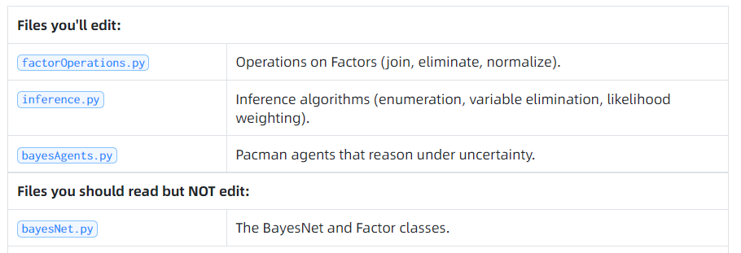

# 说明
## 文件结构

# 运行命令
python autograder.py -t test_cases/q4/1-simple-eliminate
# Tast
## Treasure-Hunting Pacman 
地图不可见。map contains two houses: a ghost house, which is probably mostly red, and a food house, which is probably mostly blue. 目标是去food不去ghost

python hunters.py -p KeyboardAgent -r